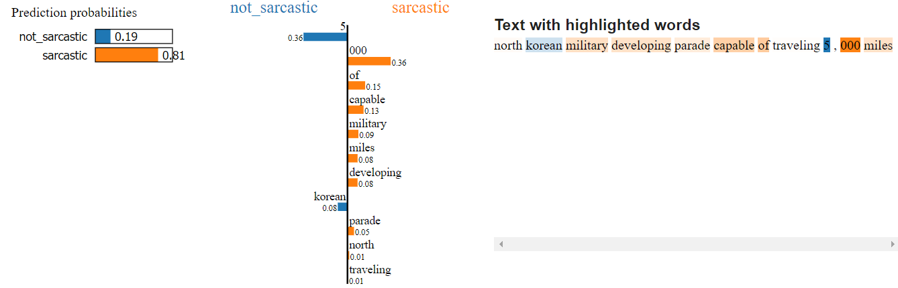
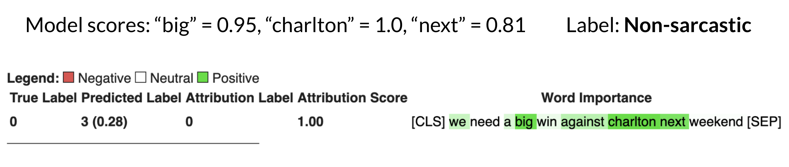

# comp550_sarcasm
Course project for COMP550 on Sarcasm Detection.

Data folder:

All the datasets can be found in the `data` folder. The files are as follows:

- `TaskB.En.test.augmented.csv`, `TaskB.En.train.augmented.csv`, and `TaskB.En.val.augmented.csv` are the data files for SubTask B containing data from SemEval 2022 and 2018.
- `train.En.csv` is the original training set (iSarcasmEval) of SemEval 2022
- `task_A_En_test.csv` is the test set of SubTask A for SemEval 2022.
- `isarcasm_train.csv` is the training set of the iSarcasm dataset for SubTask A.
- `sarcasmheadlines_train.csv` is the Sarcasm Headlines dataset for SubTask A.
- `semeval2018_train.csv` is the SemEval 2018 dataset for SubTask A.

In reference to the report, here is an additional visualization of a sarcastic example predicted by XGBoost trained on GLoVe embeddings:

Here's another visualization showing model explainability for BERT-base with Captum for a sarcastic example:

